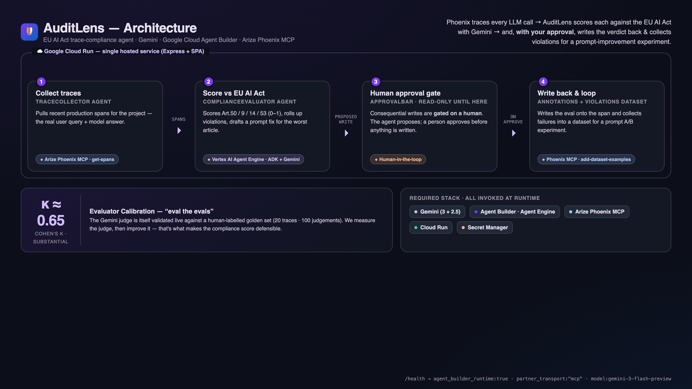

# AuditLens — Pitch Deck

*Google Cloud Rapid Agent Hackathon · Arize track. A printable version is in [DECK.pdf](DECK.pdf).*

---

## 1 · AuditLens
**The compliance layer for AI agents.**
Audits production LLM traces against the EU AI Act with Gemini — and writes the verdict back to
Arize Phoenix, with a human in the loop.

🔗 Live: https://auditlens-908307939543.europe-west1.run.app · Repo: https://github.com/manojmallick/auditlens

---

## 2 · The problem
- The **EU AI Act** (Reg. (EU) 2024/1689) is in force. Every company running LLMs in the EU must prove
  transparency (Art.50), risk management (Art.9), human oversight (Art.14), and GPAI obligations (Art.53).
- Today that's a **quarterly, ~3-day manual review** by experts — slow, expensive, and already stale by
  the time it ships.
- Fines reach **€35M or 7% of global turnover.** Nobody is watching the traces in between.

---

## 3 · The solution
AuditLens turns the quarterly manual review into a **daily, automated, 8-minute audit**:
1. **Collect** real production traces from Arize Phoenix.
2. **Score** each against the EU AI Act rubric with Gemini.
3. **Roll up** violations + draft the exact prompt fix for the worst article.
4. **Propose** writing the verdict back — **gated on human approval.**
5. **Loop**: approved violations become a dataset for a prompt A/B experiment.

It's an **agent, not a chatbot** — a multi-step pipeline with a real approval gate.

---

## 4 · Architecture

One Cloud Run service drives two agents (TraceCollector → ComplianceEvaluator), the human approval
gate, and a continuous calibration loop. See [ARCHITECTURE.md](ARCHITECTURE.md).

---

## 5 · Required tech — all invoked at runtime
*(not just named — verify with one `curl /health`)*

| Requirement | How AuditLens uses it |
|---|---|
| 🧠 **Gemini** | Gemini 3 (`gemini-3-flash-preview`) direct + Gemini 2.5 inside the agent — scores every trace |
| 🏗️ **Google Cloud Agent Builder** | A deployed **Vertex AI Agent Engine** agent (ADK) called per scoring request |
| 🔭 **Arize Phoenix** | Spawns the **Phoenix MCP server** — reads (`get-spans`) **and** writes (`add-dataset-examples`) |
| ☁️ Google Cloud | Cloud Run + Secret Manager + Vertex AI |

`agent_builder_runtime:true · partner_transport:"mcp" · model:gemini-3-flash-preview`

---

## 6 · The differentiator — *eval the evals*
Anyone can have an LLM "judge" compliance. **The reliability hole is: how do you know the judge is right?**

AuditLens validates its own Gemini evaluator **live** against a human-labelled golden set:
- **Cohen's κ ≈ 0.65 ("substantial" agreement)** · 20 traces · 100 article-judgements · 85% accuracy.
- We *measured* the judge, found it over-flagged GPAI, **tuned it**, and κ rose 0.24 → 0.65.

> We treat the judge like any model: measure it, then improve it. That's what makes the compliance
> score defensible — and it's honest, live, on real Gemini runs.

---

## 7 · Demo (90 seconds, self-driving)
Open `…/?tour=auto` — the in-app **Judge Tour** spotlights and drives the whole flow:
Dashboard → per-article gauges → live calibration → open a violating trace → **the approval gate** →
the improvement loop. Everything is a real call; instant via a prewarmed cache.

---

## 8 · Impact
- **Who**: any team shipping LLMs into the EU — fintech, health, HR, gov, support.
- **Value**: continuous conformity evidence instead of a stale quarterly PDF; catch drift the day it
  happens; an audit trail of approvals.
- **Wedge**: it audits the agents you already run — point any OpenInference-instrumented app at your
  Phoenix project and AuditLens becomes the conformity layer for the whole platform.

---

## 9 · Stack & links
**Gemini · Vertex AI Agent Engine (ADK) · Arize Phoenix MCP · Cloud Run · Secret Manager · Node/Express**

- 🌐 Live: https://auditlens-908307939543.europe-west1.run.app
- 💻 Repo: https://github.com/manojmallick/auditlens
- 📐 [ARCHITECTURE.md](ARCHITECTURE.md) · 🎨 [DESIGN_SYSTEM.md](DESIGN_SYSTEM.md) · ▶️ [DEMO.md](DEMO.md)

*Built new for the Google Cloud Rapid Agent Hackathon, 2026.*
